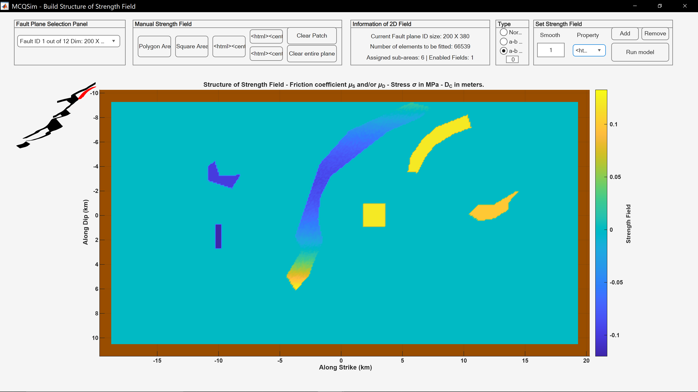

This add-on for MCQSim , an earthquake-cycle simulation framework , provides users with the capability to construct and manipulate frictional asperities manually based on critical distance, friction coefficients, or effective normal stress. The tool can be used either to define deterministic frictional-strength fields directly or in combination with stochastic spatial distributions and filters, including fractal, Von Kármán, Gaussian, and exponential models.
It allows users to modify frictional properties by selecting rectangular, square, polygonal regions, or even the entire fault plane. Transitions between asperities and the background medium can be smoothed using a user-defined smoothing factor. Asperities may be assigned constant values or depth-dependent variations following the a−b frictional profile. The resulting two-dimensional fields can be saved and loaded as ASCII files, enabling further manual editing of coordinates and frictional properties.

